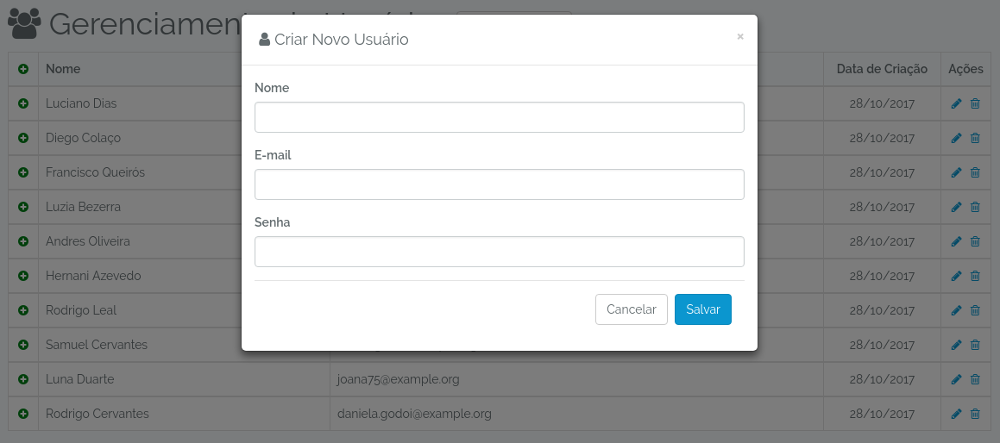
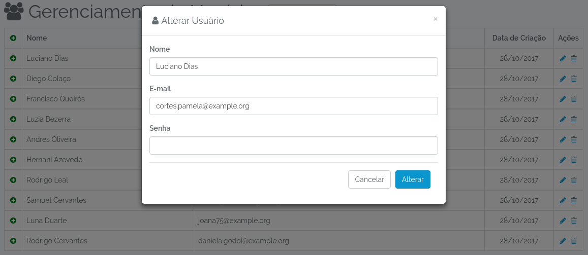
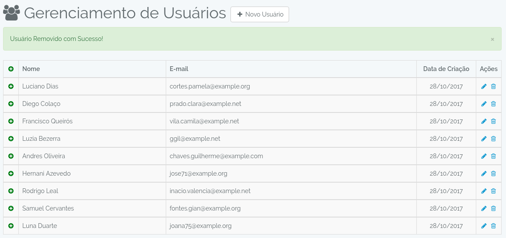
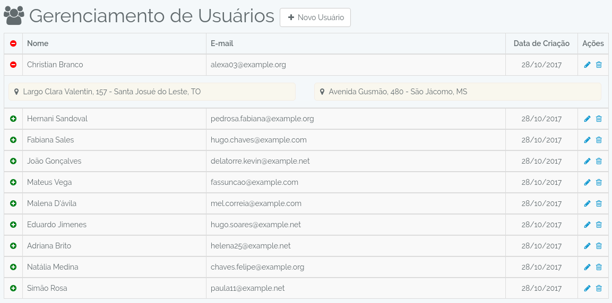

# l5vueka-laravel-vuejs
Laravel 5.3 e Vue.js em Ambiente Dockerizado

> Este projeto foi desenvolvido durante o acompanhamento do curso de Laravel 5.3 com VueJS 2.0 disponível no site da [Edukee](http://www.treinatom.com.br/pt/edukee/detalhes-do-evento/2e7f35a3b0dc111b06cf6047c6d1fb1d37f66fdd).

## Sobre o Curso
TL;DR 

Curso rápido que mostrará como usar o Vue.js em uma aplicação Laravel, com foco na troca de dados entre as duas ferramentas. 

O tipo de aplicação desenvolvida será uma aplicação híbrida (o que quer dizer que não é uma Single Page Application). 

## Temas abordados
- **Laravel** versão 5.3;
- **Vue.js** versão 2.0;
- **Node.js**;
- **NPM**;
- **Elixir**;
- **Gulp**;
- **Webpack**;
- **Browserify**;
- **Rollup**;
- **Componentes**;
- **Diretivas**;
- **Eventos**;
- **Vuex**;
- **Data Binding**;
- **Computed Properties**. 

## Pré-requisitos do Curso
Espera-se que o aluno já tenha o ambiente `PHP` instalado em sua máquina, pois esta parte não será coberta pelo curso.

> Cabe resaltar que este repositório tem por finalidade eliminar a obrigatoriedade de preparação de todo um ambiente 
de desenvolvimento `PHP`. A única obrigatoriedade para executar o projeto, será a de ter minimamente instalados e devidamente
configurados em sua máquina os serviços/ferramentas `docker` e `docker-compose`. 

## Adaptações
Como tenho preferência por trabalhar em ambientes dockerizados, fiz algumas adaptações no projeto, implementando `containers` para rodar a aplicação. Para isto, fiz uso do **[Ambientum](https://github.com/codecasts/ambientum)**.

> E qual a vantagem dessas adaptações que fiz? Existem diversas vantagens, mas vou apenas frisar uma delas, que é a não obrigação de instalação e preparação de todo um ambiente de desenvolvimento. Que necessitaria a instalação por exemplo do php, nodejs, mysql e etc.

## Mas o que é? E o que faz esse tal Ambientum?
O Ambientum é um conjunto de imagens **[Docker](https://www.docker.com/)** desenvolvidas, mantidas e distribuidas pelo **[CODECASTS](https://codecasts.com.br)**. E ele pode lhe ajudar com algumas coisas incríveis, os 3 cenários mais comuns estão listados a seguir:

- **Rodar Laravel e/ou Vue.JS em Desenvolvimento.**
- **Rodar Laravel e/ou Vue.JS em Produção (Includindo Integração Contínua).**
- **Substituir dependências locais com comandos que rodam no Docker.**

## Blz, e o que eu Preciso Saber Antes de Começar?

Sem sombra de dúvidas, o Ambientum irá facilitar a sua vida em muito, principalmente no que diz respeito a ambientes de desenvolvimento dockerizados, mas antes de você começar a brincar com o Ambientum, alguns conhecimentos são necessários:

* O básico sobre Docker e Containers.
* Estar confortável usando a linha de comando.
* Saber operar o docker-compose.
* Ler o **README** do Ambientum.

Mas não se preocupem, o readme está escrito em dois idiomas: Inglês e Português.

## Instalação e Execução

1. Faça o clone do repositório e no terminal navegue até a pasta criada com os comandos abaixo:

```
git clone git@github.com:vs0uz4/l5vueka-laravel-vuejs.git
cd l5vueka-laravel-vuejs
```

2. Faça uma cópia do `docker-compose.yaml.example` para um novo arquivo com nome de `docker-compose.yaml`, abra em um editor de sua preferência e faça a troca de toda ocorrência de `sandbox` para algo que referêncie melhor o projeto, como por exemplo, `l5vueka`. 

```
cp docker-compose.yaml.example docker-compose.yaml
```

Exemplo de configuração das variáveis.
```
version: '2.1'

volumes:
  l5vuek4-config:
    driver: local

  l5vuek4-cache:
    driver: local

  l5vuek4-local:
    driver: local

  l5vuek4-yarn:
    driver: local

  l5vuek4-npm:
    driver: local

  l5vuek4-mysql-data:
    driver: local

  l5vuek4-redis-data:
    driver: local

services:
  mysql:
    image: ambientum/mysql:5.7
    container_name: l5vuek4-mysql
    networks:
      l5vuek4_net:
        ipv4_address: 192.168.0.2
    volumes:
      - l5vuek4-mysql-data:/var/lib/mysql
    ports:
      - "3306:3306"
    environment:
      - MYSQL_ROOT_PASSWORD=l5vuek4
      - MYSQL_DATABASE=l5vuek4
      - MYSQL_USER=l5vuek4
      - MYSQL_PASSWORD=l5vuek4
      ...
```

> As variáveis definidas no arquivo `docker-compose.yaml` para configuração dos containers, como por exemplo dos serviços de banco de dados, como `mysql` e `redis`, devem ser, obrigatoriamente iguais as que serão definidas no arquivo `.env`.

3. Instale as dependências do `Laravel`, e crie o arquivo `.env`, com os seguintes comandos:

```
docker-compose create
docker-compose run app composer install
docker-compose run app composer run-script post-root-package-install
docker-compose run app composer run-script post-create-project-cmd
``` 

> Um exemplo de como deve-se configurar as variáveis do arquivo `.env`, segue logo abaixo:

```
APP_ENV=local
APP_KEY=base64:t4LocTfkTQ20mGLKZjKyNZCYphwqClqrW6aAeBd6HS8=
APP_DEBUG=true
APP_LOG_LEVEL=debug
APP_URL=http://localhost

DB_CONNECTION=mysql
DB_HOST=192.168.0.2
DB_PORT=3306
DB_DATABASE=l5vuek4
DB_USERNAME=l5vuek4
DB_PASSWORD=l5vuek4

BROADCAST_DRIVER=log
CACHE_DRIVER=file
SESSION_DRIVER=file
QUEUE_DRIVER=sync

REDIS_HOST=192.168.0.3
REDIS_PASSWORD=null
REDIS_PORT=6379
```

> Note que utilizei os endereços de IP dos containers, conforme estão configurados no arquivo `docker-compose.yaml`. Existe ainda a possibilidade de utilizar os nomes dos serviços, descritos no arquivo `docker-compose.yaml` como `hostname`, existem diversos exemplos de configuração nestes moldes na internet.

4. Atualize o `npm` e instale todas as dependências do `node` e com os comandos abaixo:

```
docker-compose run dev npm install -g npm gulp-cli
docker-compose run dev yarn
```

5. Prepare a base de dados, criando e populando as tabelas com dados fictícios, com os seguintes comandos:

```
docker-compose run app php artisan migrate
docker-compose run app php artisan db:seed
```

6. Inicialize os containers.

```
docker-compose up
```

> Provavelmente será retornado um erro na tela, ao se tentar inicializar um dos containers. Mais precisamente o container `dev`, que é reponsável por todo o suporte ao `nodejs`. O que acontece especificamente é que este container executa o seguinte comando ao ser startado `gulp watch`. 

> O motivo do erro é que existe um limite no sistema para quantos arquivos podem ser vistos por um usuário, usando o comando abaixo em uma janela de terminal, podemos simplesmente aumentar o limite, e o erro simplesmente sumirá.

```
echo fs.inotify.max_user_watches=582222 | sudo tee -a /etc/sysctl.conf && sudo sysctl -p
```

## Observações
Devido ao projeto estar rodando em `containers` a funcionalidade do BrowserSync de abrir a página do projeto no browser automaticamente quando executamos o comando `gulp watch`, está desativada. Então faz-se necessário que abramos a janela manualmente.

> O comando `gulp watch` já está sendo executado automaticamente ao inicializar os containers, logo não é possível roda-lo novamente em linha de comando, pois ocorrerá um erro devido as portas já estarem sendo utilizadas.

Caso necessite de rodar o `gulp` via linha de comando, enquanto o `watch` estiver rodando, basta que em uma outra janela do terminal, execute o seguinte comando:

```
docker-compose exec dev gulp
```

> Desta vez, ao invés de utilizar o comando docker-compose passando o parametro `run`, devemos utilizar o parâmetro `exec`, de modo que possamos executar tais comando no container que já encontra-se em execução.

## Sugestão
Caso necessite testar chamadas a API, sugiro que utilize o `Postman` para testar suas chamadas. [https://www.getpostman.com/](https://www.getpostman.com/).

## Telas

### Tela Inicial


### Usuários


### Criar Usuário 


### Alterar Usuário 


### Remover Usuários (Alerta de Remoção)


### Endereços do Usuário


## TODO
Desenvolver funcionalidade de CRUD completo para os endereços dos usuários.